# NOCAP AI - Visual Project Workflow

This document provides comprehensive visual diagrams showcasing how the NoCapAI fake news detection system works end-to-end.

---

## 🏗️ System Architecture Overview

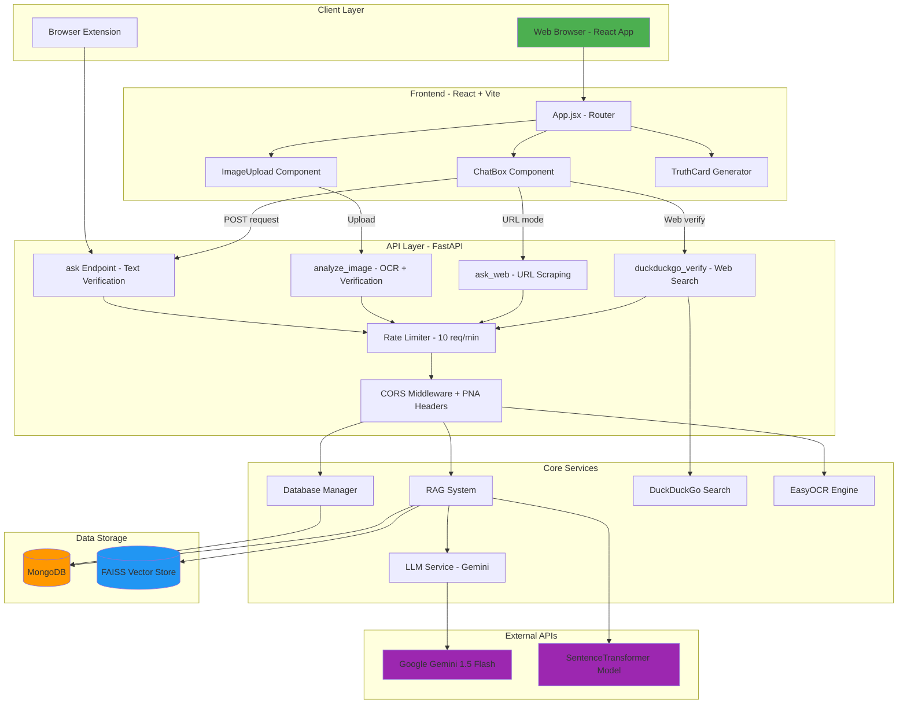

---

## 💬 User Verification Flow - Detailed

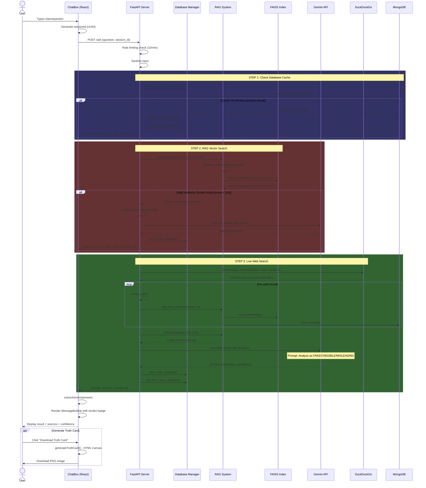

---

## 📸 Image Verification Flow

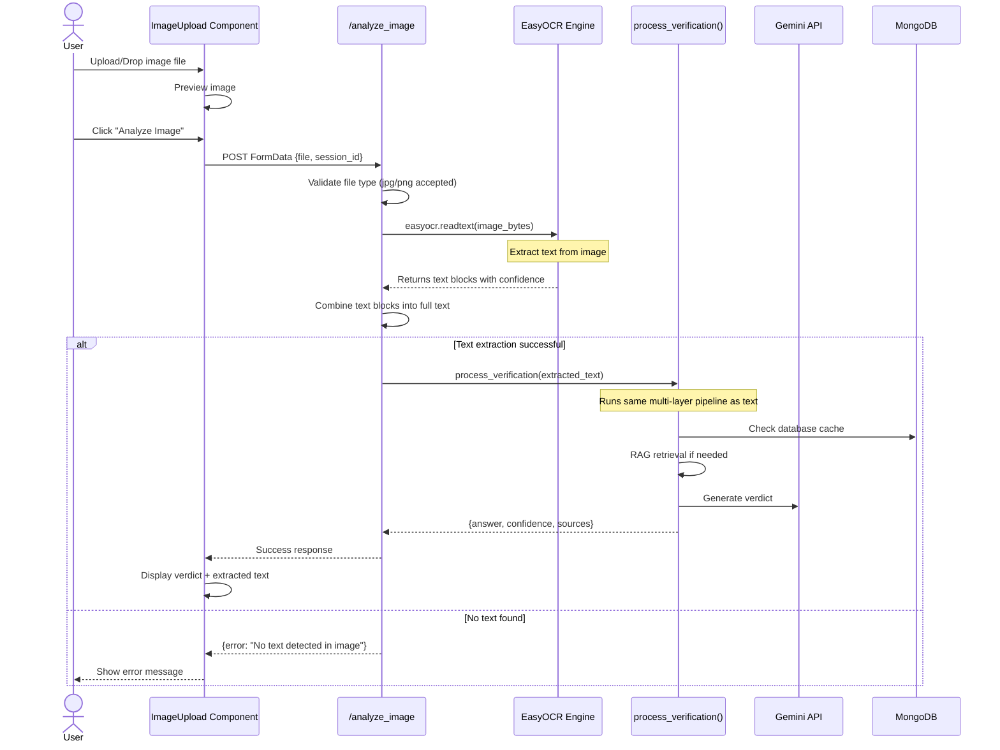

---

## 🌐 URL Analysis Flow

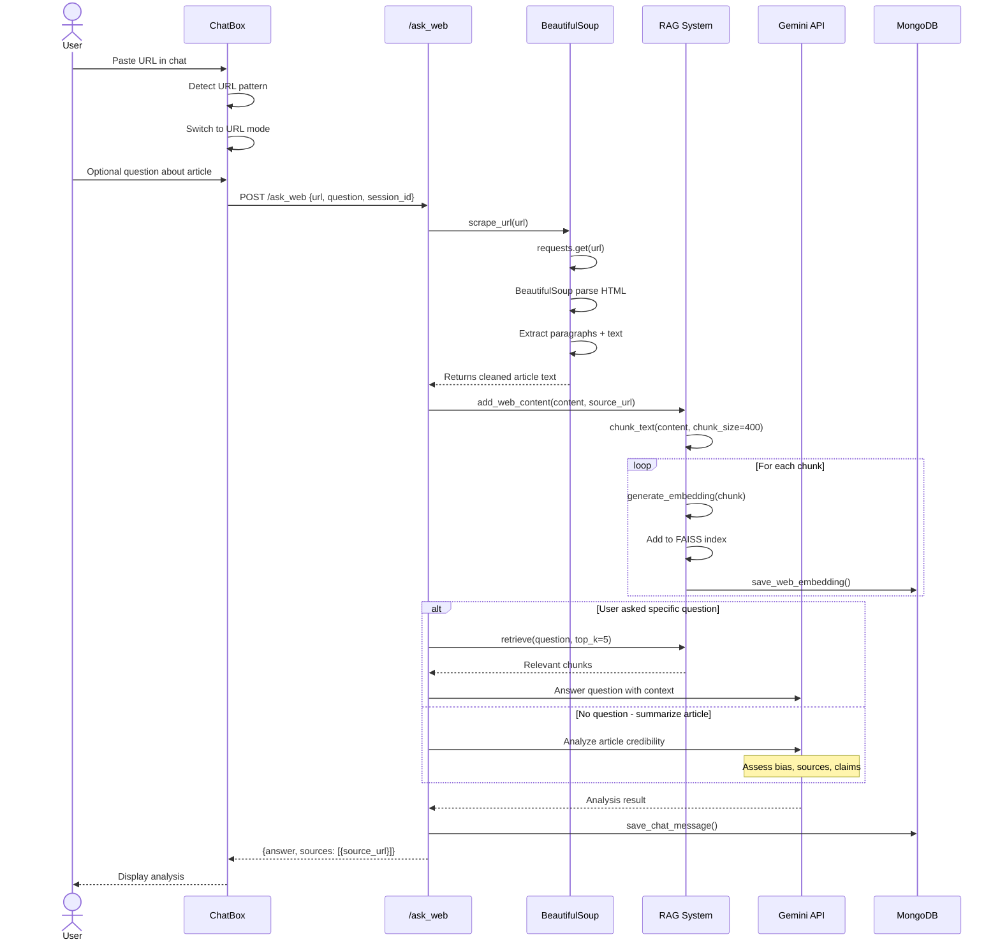

---

## 🧩 Browser Extension Flow

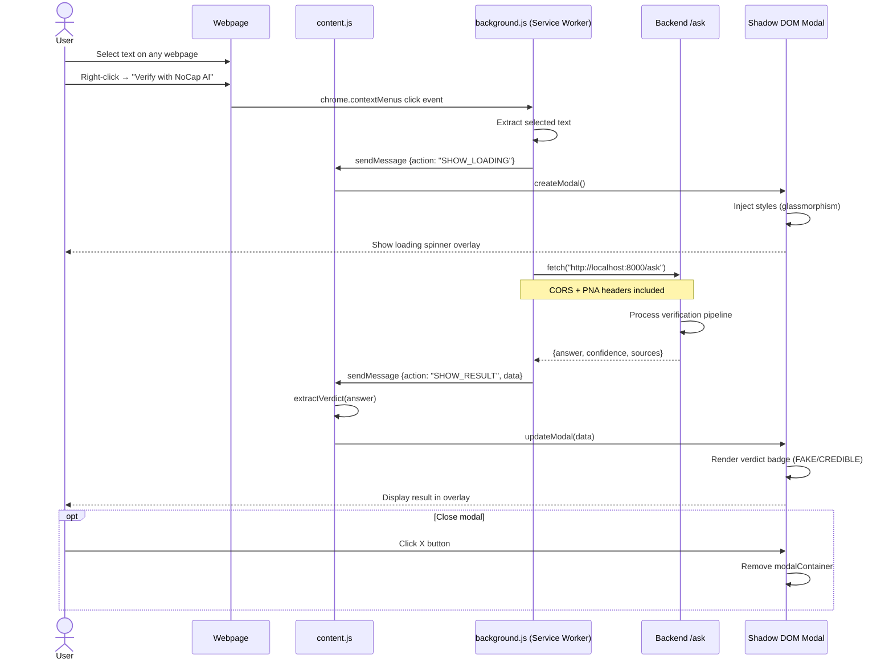

---

## 🔍 RAG (Retrieval Augmented Generation) Pipeline

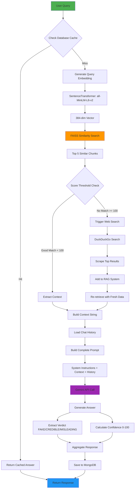

---

## 🗄️ Data Models & Storage

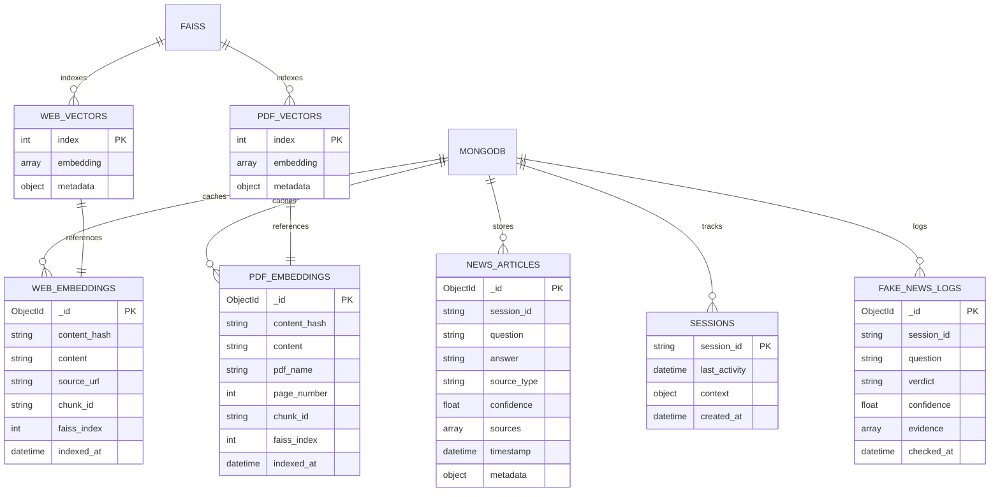

---

## 🎯 Component Interaction Map

```mermaid
graph LR
    subgraph "React Components"
        A[App.jsx<br/>Router + Layout]
        B[ChatBox.jsx<br/>Main Chat Interface]
        C[ImageUpload.jsx<br/>OCR Upload]
        D[TruthCardGenerator.jsx<br/>Social Media Export]
        E[MessageBubble.jsx<br/>Reply Display]
    end
    
    subgraph "Frontend Services"
        F[Voice Recognition<br/>Web Speech API]
        G[File Upload Handler]
    end
    
    subgraph "Backend Routes"
        H[ask<br/>Text Verification]
        I[analyze_image<br/>OCR Pipeline]
        J[ask_web<br/>URL Scraping]
        K[duckduckgo_verify<br/>Web Search]
        L[upload_pdf<br/>PDF Processing]
    end
    
    subgraph "Core Services"
        M[rag.py<br/>RAGSystem Class]
        N[db.py<br/>DatabaseManager Class]
        O[main.py<br/>process_verification()]
    end
    
    subgraph "External Tools"
        P[EasyOCR]
        Q[BeautifulSoup]
        R[DuckDuckGo Search]
    end
    
    A --> B
    A --> C
    A --> D
    B --> E
    
    B --> F
    C --> G
    
    B --> H
    C --> I
    B --> J
    B --> K
    
    I --> P
    J --> Q
    K --> R
    
    H --> O
    I --> O
    K --> O
    
    O --> M
    O --> N
    L --> M
    
    style M fill:#FF5722
    style N fill:#FF5722
    style O fill:#FF5722
```

---

## ⚡ Request/Response Flow Examples

### Example 1: "Is 5G causing COVID-19?"

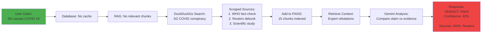

### Example 2: Screenshot Verification

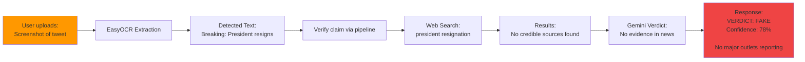

---

## 🔄 Caching & Performance Strategy

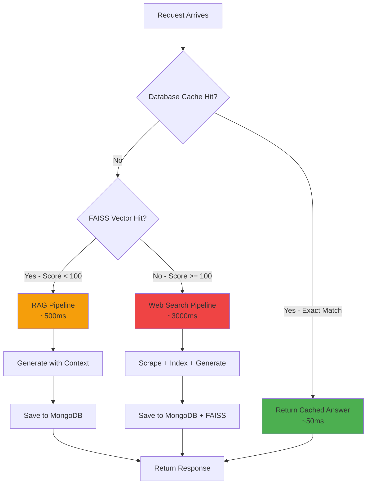

---

## 📊 Technology Stack Visualization

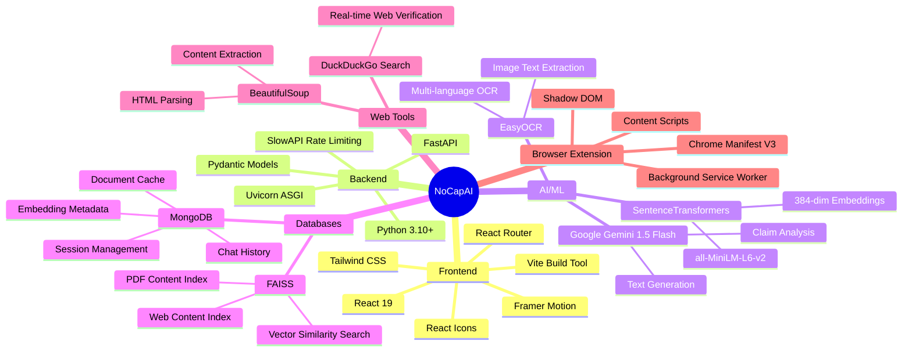

---

## 🎨 User Journey Map

### User Journey: Verifying a Claim

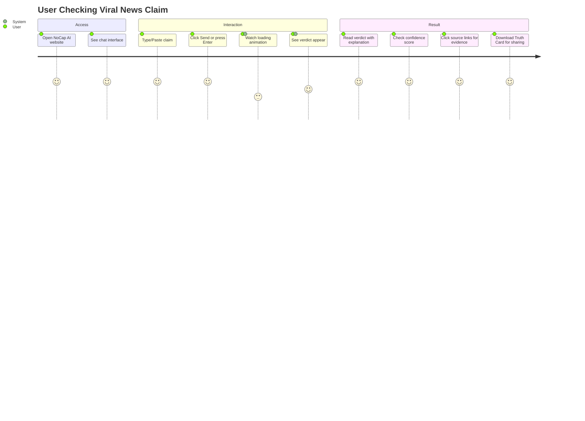

### Extension Journey: Quick Text Verification

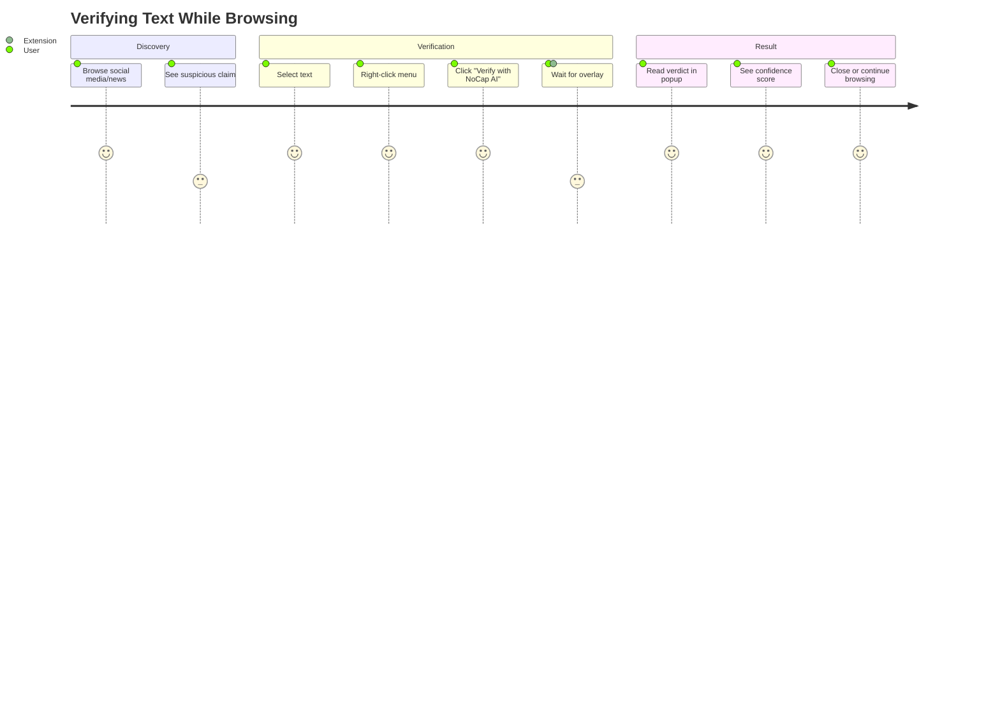

---

## 🚀 Deployment Architecture

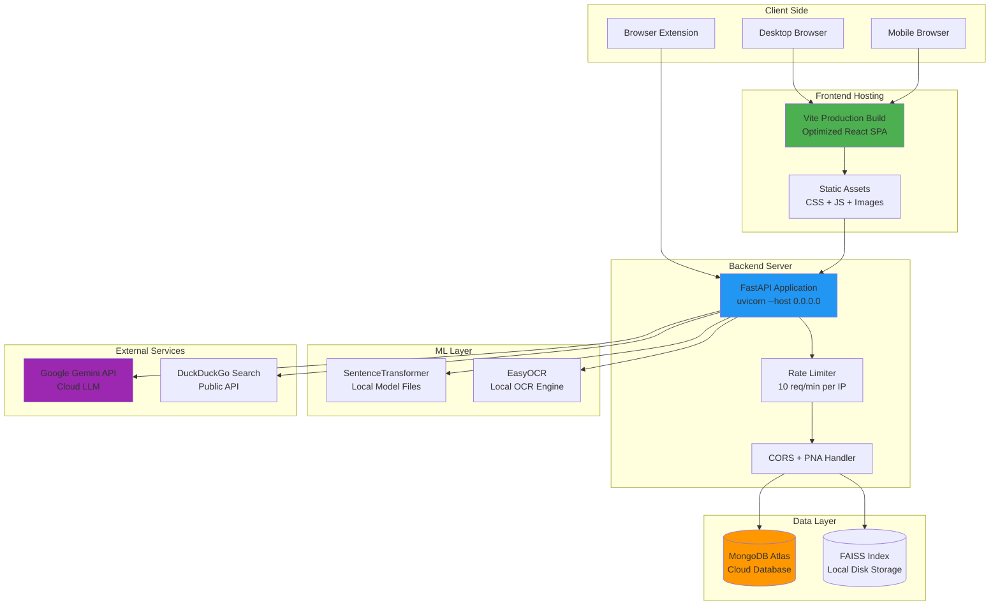

---

## 📈 Performance Metrics Flow

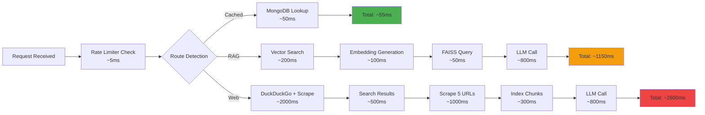

---

## 🔐 Security & Rate Limiting Flow

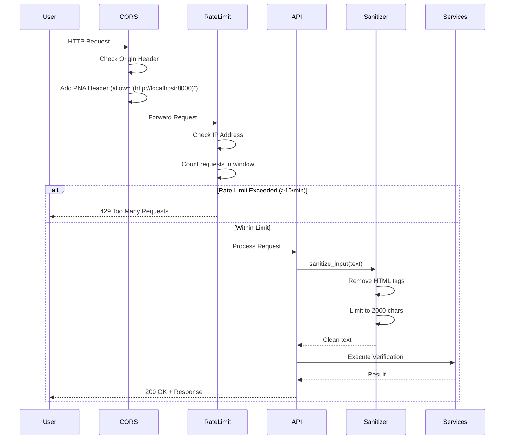

---

## 🎯 Verdict Classification Logic

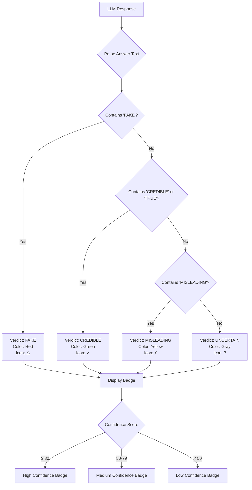

---

## 📝 Multi-Layer Verification Pipeline

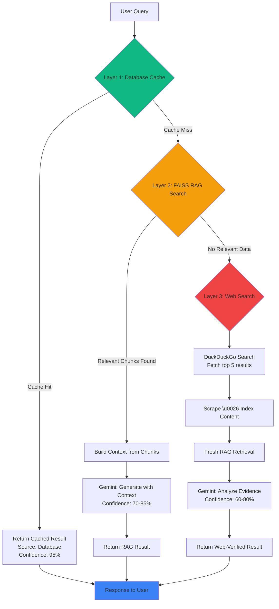

---

